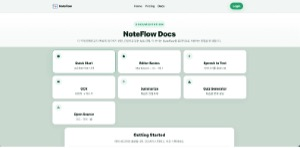
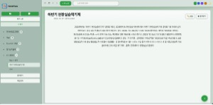
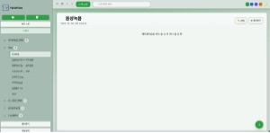
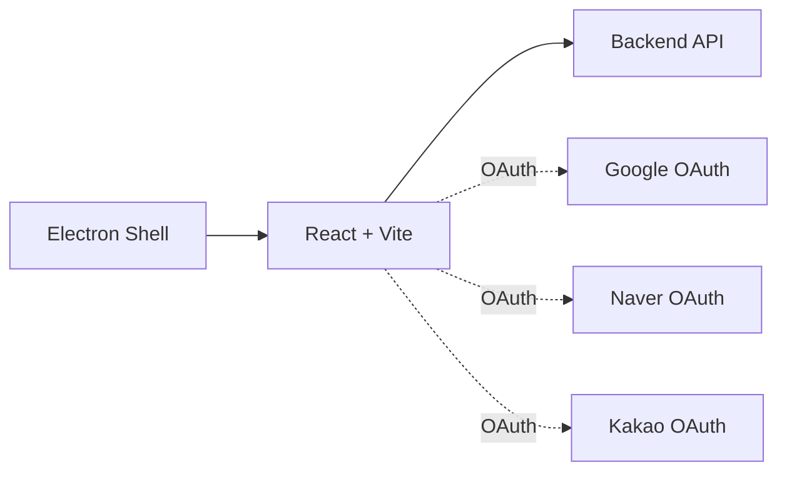

# NoteFlow Frontend

[](#)
[](#)
[](#)
[](#)
[](#)
[](#)

마크다운 편집, 음성 입력(STT), OCR, 파일 업로드, 소셜 로그인(구글·네이버·카카오)을 갖춘 노트/지식 관리용 프론트엔드입니다. 개발 편의를 위해 Vite(웹)와 Electron(데스크톱 셸)을 함께 제공합니다.

---

## 목차
- [기술 스택](#기술-스택)
- [화면](#화면)
- [핵심 기능](#핵심-기능)
- [아키텍처](#아키텍처)
- [라우팅](#라우팅)
- [로컬 실행](#로컬-실행)
- [환경 변수](#환경-변수)
- [폴더 구조](#폴더-구조)
- [API 통신 규약](#api-통신-규약)

---

## 기술 스택


---

## 화면

<p align="center">
  <!-- 로그인 및 문서 -->
  
  <br/>

  <!-- 통계 및 테마 -->
  
  <br/>

  <!-- OCR 및 음성 기능 -->
  
  <br/>

  <!-- 요약 및 문제 생성 -->
  
  
</p>

---

## 핵심 기능

- 인증/온보딩: 아이디·비번 로그인, 소셜 로그인(구글/네이버/카카오), 회원가입 라우트 제공.
- 노트 리스트: 폴더별/전체 보기, 검색·필터, 즐겨찾기 토글, 최근/즐겨찾기 탭.
- 에디터: Toast UI/Milkdown/Tiptap 조합으로 마크다운 편집·미리보기·하이라이트 지원.
- 파일 업로드: 이미지/파일 드래그·선택 업로드 → 자동 노트 생성 및 미디어 임베드.
- 음성 입력(STT): Web Speech API 기반 한국어 연속 입력 → 편집기에 실시간 반영.
- OCR: 이미지 → 텍스트 변환(API 연동) 후 새 노트 생성 및 결과 미리보기.
- 요약/문제생성: 백엔드 연동으로 긴 문서 요약·예상문제 자동 생성 후 노트 저장.
- 레이아웃: Sidebar/Topbar/Bottombar, 단축 액션(ActionDock), 토스트/상태표시.

---

## 아키텍처



---

## 라우팅

- 공개: `/`(로그인) · `/signup` · `/home` · `/pricing` · `/docs`
- 소셜 콜백: `/naver/callback` · `/kakao/callback`
- 앱: `/main` · `/main/:folderId` · `/notes/new` · `/notes/:id` · `/stt`
- 인증 가드: 토큰 미보유 시 보호 라우트 접근 시 `/` 리다이렉트

---

## 로컬 실행

### 1) 요구사항
- Node.js 18+

### 2) 설치
```bash
# 1) Electron 셸 + 툴 설치 (루트)
cd Frontend
npm i

# 2) React 앱 설치
cd react-app
npm i
```

### 3) 개발 실행
```bash
# Electron 셸과 Vite dev 서버 동시 실행
cd Frontend
npm run dev

# 또는: 웹만 실행
cd Frontend/react-app
npm run dev  # default: http://localhost:5174
```

---

## 환경 변수

Frontend/react-app/.env

```env
VITE_API_BASE_URL=http://localhost:8000
VITE_GOOGLE_CLIENT_ID=YOUR_GOOGLE_OAUTH_CLIENT_ID
VITE_NAVER_CLIENT_ID=YOUR_NAVER_CLIENT_ID
VITE_NAVER_REDIRECT_URI=http://localhost:5174/naver/callback
VITE_KAKAO_CLIENT_ID=YOUR_KAKAO_REST_API_KEY
```

필수 포인트
- JWT 저장: `localStorage.access_token`에 저장/사용
- 개발 포트: Vite `5174` · Electron이 해당 주소를 로드

---

## 폴더 구조

```
Frontend/
├── main.js                  # Electron 진입 (개발 셸 · http://localhost:5174 로드)
├── package.json             # dev 스크립트(concurrently, wait-on, electron)
├── preload.js               # (옵션) 프리로드 스크립트
├── react-app/               # Vite 기반 React 앱
│   ├── src/
│   │   ├── App.tsx         # 라우팅 엔트리
│   │   ├── main.tsx        # 앱 부트스트랩(Google OAuth Provider)
│   │   ├── components/     # 레이아웃/툴바/사이드바/편집기/뷰어 등 UI
│   │   ├── screen/         # Login/Signup/Main/NoteDetail/NewNote/STT/Docs 등
│   │   ├── css/            # 화면·컴포넌트 스타일 및 토큰
│   │   └── utils/          # fetch 로거, 유틸
│   └── package.json        # Vite, React, 에디터 관련 의존성
└── utils/
    └── qg_service.py       # (개발 보조) 문제 생성 API 예시 스크립트
```

---

## API 통신 규약

- 베이스 URL: `VITE_API_BASE_URL`
- 인증: `Authorization: Bearer <access_token>` 헤더 사용
- 주요 엔드포인트(예)
  - 인증: `POST /api/v1/login`, `POST /api/v1/login/google`, `POST /api/v1/register`
  - 노트: `GET/POST/PUT/DELETE /api/v1/notes`, `POST /api/v1/notes/{id}/favorite`
  - 요약: `POST /api/v1/notes/{id}/summarize_sync?longdoc=true`
  - 파일: `POST /api/v1/files/upload`, `POST /api/v1/files/ocr?langs=kor+eng&max_pages=50`

---

주의
- 본 프론트는 백엔드 API와 연동되어 동작합니다. `VITE_API_BASE_URL` 및 OAuth 클라이언트 설정이 없으면 일부 기능이 제한됩니다.
- Electron은 개발 셸 용도로만 구성되어 있으며 패키징 설정은 포함하지 않습니다.
